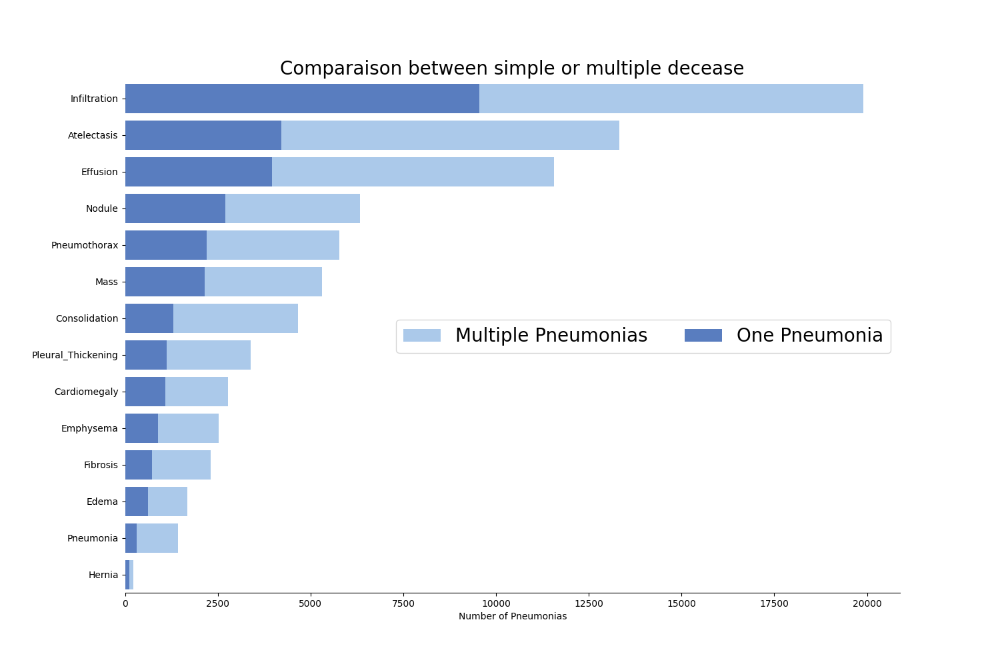

# NIH Chest Xray Dataset 

Image Size 1024 * 1024 

NIH Chest X-ray Dataset consists of 112,120 X-ray images with disease labels from 30,805 unique patients each image can contain multiple diseases. 
Data set includes patient information such as patient id, age, gender, and follow-up visits

## Data Distribution 

```Finding Labels
No Finding                  60361
Infiltration                 9547
Atelectasis                  4215
Effusion                     3955
Nodule                       2705
Pneumothorax                 2194
Mass                         2139
Effusion|Infiltration        1603
Atelectasis|Infiltration     1350
Consolidation                1310
Atelectasis|Effusion         1165
Pleural_Thickening           1126
Cardiomegaly                 1093
Emphysema                     892
Infiltration|Nodule           829
```

### Images with single labels vs Multi Labeled Images 



## Implementation Discussion

### Preprocessing 

To prepare the dataset to be fed through the neural network, several preprocessing steps and data augmentation techniques were applied. The process began by reading in the 'Data_Entry_2017.csv' file and creating a dataframe. 
Then, a loop was executed to map the image paths to the corresponding rows in the dataframe.

For the labels, a simplified set of 14 primary classes (excluding 'No Finding') was created and stored in an array called 'condition_labels'. To construct an auto-encoder for the labels, another loop was performed over the 'condition_labels' array. For each label, a new column was added to the dataframe, named after the label. The values in this column were set to 1.0 if the corresponding condition was present in the 'Finding Labels' column, and 0 otherwise. This transformation was achieved using a lambda function that checked the presence of the label in the 'Finding Labels' column.

In addition, a new column called 'disease_vec' was introduced to the dataframe. This column contained a list of values representing the presence or absence of each disease condition for each image in each row of the dataframe. This transformation was implemented using a lambda function that selected the values from the condition columns created in the previous step and converted them into a list.

From there I created a custom PyTorch dataset class called XrayDataset that takes a DataFrame containing image paths and labels as input. The ```__getitem__``` method retrieves a sample by opening the image at a given index, converting it to RGB, and applying specified transformations. It also extracts the corresponding label from the DataFrame and converts it to a NumPy array. The ```__len__```method returns the total number of samples in the dataset.

### Class Imbalance

 To handle this issue, the code calculates the number of positive and negative labels for each class and then computes a positive weight for each class based on the ratio of negative to positive labels. This positive weight is then used in the loss function to give more importance to underrepresented positive classes during model training, effectively tackling data imbalance and improving the model's performance.

| Classes            | Training Data Frame Distribution | Test Data Frame Distribution |
|--------------------|----------------------------------|------------------------------|
| Atelectasis        | 9289.0                           | 2270.0                       |
| Consolidation      | 3742.0                           | 925.0                        |
| Infiltration       | 15937.0                          | 3957.0                       |
| Pneumothorax       | 4276.0                           | 1026.0                       |
| Edema              | 1842.0                           | 461.0                        |
| Emphysema          | 2032.0                           | 484.0                        |
| Fibrosis           | 1330.0                           | 356.0                        |
| Effusion           | 10672.0                          | 2645.0                       |
| Pneumonia          | 1169.0                           | 262.0                        |
| Pleural_Thickening | 2753.0                           | 632.0                        |
| Cardiomegaly       | 2203.0                           | 573.0                        | 
| Nodule             | 5069.0                           | 1262.0                       |
| Mass               | 4651.0                           | 1131.0                       |
| Hernia             | 185.0                            | 42.0                         |
| No Finding         | 48218.0                          | 12143.0                      |   

## Training

For the training and testing of the model, I employed the BCEWithLogitsLoss() loss function, which applies a sigmoid transformation to the data, resulting in values between 0 and 1. 
To align these values with the label tensor, I utilized a threshold to round the data down to 0 or up to 1, effectively converting it into binary form. This gets the predicted labels into a form which can be
compared against the actual labels 

## Measuring the models performance 

For measuring the performance of the model I included some multi-label confusion matrix to get a insight on what the model is predicting for each class.
Also, I included a ROC to look at the True positive vs False positive rate which includes a legend with the auc score for each class 

During the testing I would stop the model to evaluate the predicted label probabilities vs the actual labels then I would look again after I round the probabilities to see what the model is predicting overall

## Models

DenseNet 121

Res-Net50

Custom Model - This model has a custom architecture with 4 convolution filters and 3 fully connected layers.

## Testing 

### Hyperparameters for the test 
```
learning_rate = 0.001
criterion = nn.BCEWithLogitsLoss()
optimizer = torch.optim.Adam(model.parameters(), lr=learning_rate, weight_decay=weight_decay)
```

The model was evaluated at multiple epochs, including 20, 35, and 40 to assess its performance at different stages of training. 
Additionally, various threshold values, such as 0.25, 0.35 and 0.5, were tested to determine the impact on classification results. 
This comprehensive evaluation allowed for a thorough analysis of the model's performance across different training epochs and threshold values.


## Observations 

During the testing phase, I noticed the threshold's impact on the model's accuracy and true positive rate. When the threshold was lowered, the model's overall accuracy exhibited a decrease, but this reduction in accuracy was accompanied by an increase in the true positive rate as revealed by the confusion matrix. 
On the other hand, raising the threshold resulted in an increase in overall accuracy, but this increment in accuracy was accompanied by a decrease in the true positive rate

The model's accuracy is significantly influenced by the data distribution of all 15 labels in the training dataset. Notably, it achieves a remarkable accuracy of 82-86% in predicting classes like Effusion and Infiltration, which are seen as the second and third most frequent labels in the dataset. Additionally, the model shows a consistent accuracy rate of 60-64% in predicting "no finding," which happens to be the most prevalent class in the training data. These findings suggest that the model tends to perform better on classes that it has encountered more frequently during training, while still showing respectable accuracy for the other classes.


## Results 

Model: DenseNet 121

Epochs: 25

Training Size:18000

Testing size:1000

Class Accuracy:


Model: ResNet-50

Epochs: 25

Training Size: 89600

Testing size: 20000

Threshold: 0.5 

Class Accuracy:
Prediction Accuracy per Class:
````
Atelectasis: 0.8949

Consolidation: 0.9587

Infiltration: 0.8237

Pneumothorax: 0.9514

Edema: 0.9794

Emphysema: 0.9782

Fibrosis: 0.9841

Effusion: 0.8650

Pneumonia: 0.9883

Pleural_Thickening: 0.9700

Cardiomegaly: 0.9738

Nodule: 0.9437

Mass: 0.9494

Hernia: 0.9981

No Finding: 0.6078

````


Model: Custom Model

Epochs: 20

Training Size: 18000 

Testing size: 10000

Threshold : 0.5

Class Accuracy:
Prediction Accuracy per Class:
```
Atelectasis: 0.8964
Consolidation: 0.9586
Infiltration: 0.8239
Pneumothorax: 0.9536
Edema: 0.9791
Emphysema: 0.9768
Fibrosis: 0.9827
Effusion: 0.8816
Pneumonia: 0.9886
Pleural_Thickening: 0.9717
Cardiomegaly: 0.9752
Nodule: 0.9441
Mass: 0.9489
Hernia: 0.9985
No Finding: 0.5406
````


