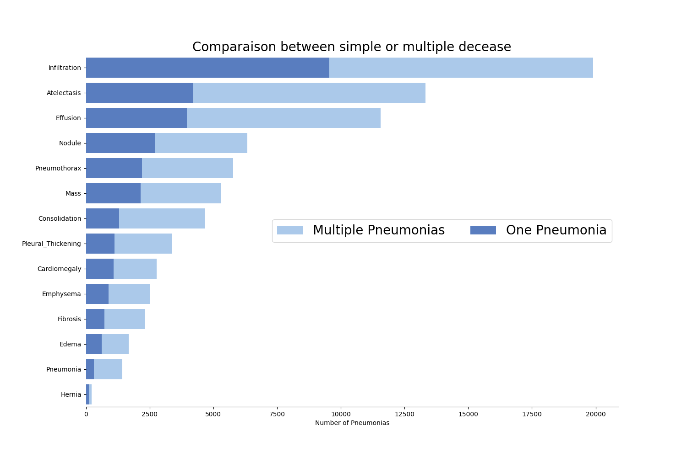

# NIH Chest Xray Dataset 

Image Size 1024 * 1024 

Data set includes patient information such as patient id, age, gender, and follow-up visits 

## Data Distribution 

```Finding Labels
No Finding                  60361
Infiltration                 9547
Atelectasis                  4215
Effusion                     3955
Nodule                       2705
Pneumothorax                 2194
Mass                         2139
Effusion|Infiltration        1603
Atelectasis|Infiltration     1350
Consolidation                1310
Atelectasis|Effusion         1165
Pleural_Thickening           1126
Cardiomegaly                 1093
Emphysema                     892
Infiltration|Nodule           829
```


### Data Graph



## Implementation 

NIH Chest X-ray Dataset consists of 112,120 X-ray images with disease labels from 30,805 unique patients. 
I read in the data into all_xray_df dataframe for the labels on each image. I set up and auto encoder to represent the multiple disease in the images

```
learning_rate = 0.001
criterion = nn.BCEWithLogitsLoss()
optimizer = torch.optim.Adam(model.parameters(), lr=learning_rate, weight_decay=weight_decay)
```

In my model, I employed the BCEWithLogitsLoss() loss function, which applies a sigmoid transformation to the data, resulting in values between 0 and 1. 
To align these values with the label tensor, I utilized a threshold to round the data down to 0 or up to 1, effectively converting it into binary form. 
By adjusting the model's threshold, I was able to observe changes in accuracy and the true positive rate within the multi-label confusion matrix for each class. 

## Model 

Model - DenseNet 121 
Model  - A custom architecture with 4 convolution filters and 3 fully connected layers 

## Model Accuracy 


